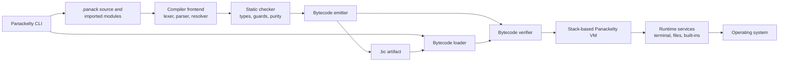
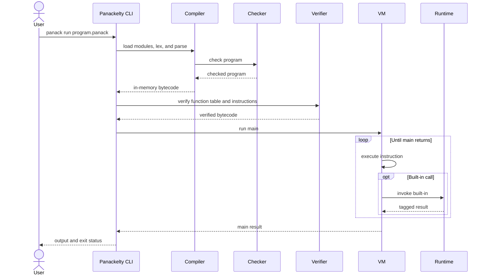
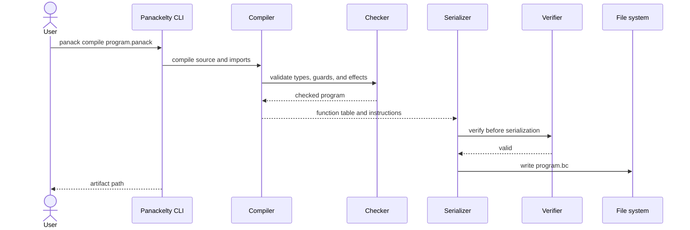
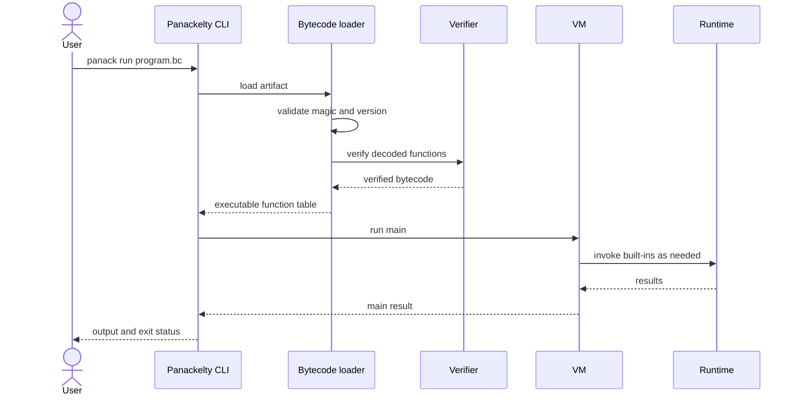
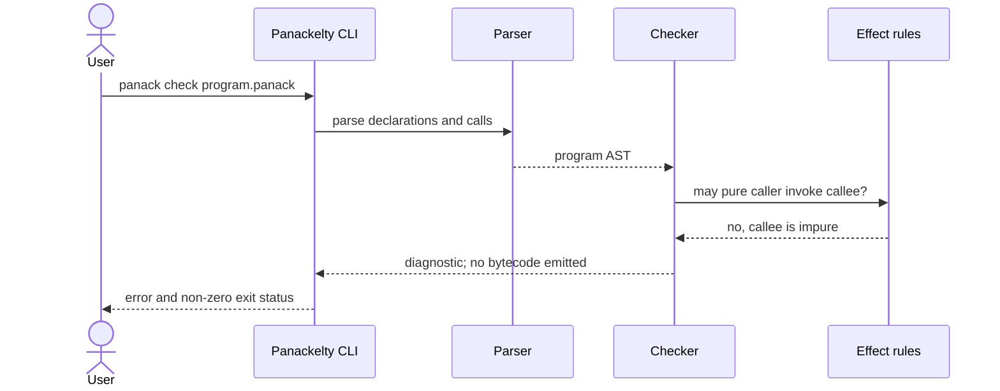
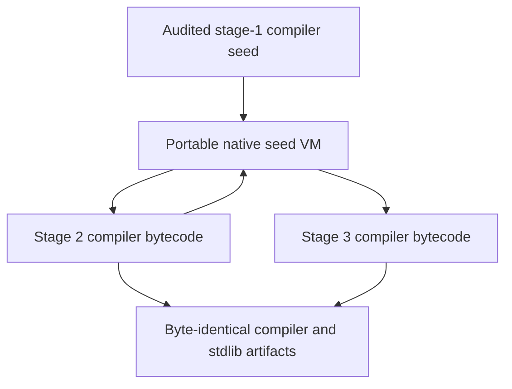

# Panackelty architecture

## Overview

Panackelty is a compiled language whose execution contract is its bytecode virtual
machine. Source execution is convenient shorthand for compiling to bytecode in
memory and passing that bytecode through the same VM used for saved `.bc`
files. There is no separate AST interpreter.

The public implementation is self-hosted. The `panack` launcher runs the
audited compiler seed on the portable C11 VM; that compiler is implemented by
the `.panack` sources under `src/compiler`. Version-8 artifacts execute on the
same VM. Stable component boundaries live under `src/compiler`,
`src/bytecode`, `src/vm`, and `src/runtime`.

Python code is intentionally confined to the transitional development oracle
in `src/bootstrap`, a temporary import-compatibility facade, and development
tests. It is absent from build, execution, installation, and package artifacts.
The release smoke gate extracts and relocates the final archive, enters a fresh
working directory, removes Python, `make`, and compiler commands from `PATH`,
then checks the public CLI, source compilation and execution, bundled standard
library discovery, argument forwarding, saved bytecode, and malformed-bytecode
rejection through the extracted `panack` command alone.

## Logical view



The major components are:

| Component | Responsibility | Current location |
| --- | --- | --- |
| CLI | Dispatches `check`, `compile`, `run`, and `disasm` | Native launcher `panack`; Panackelty driver in `src/compiler/driver.panack` |
| Compiler | Loads modules and performs lexing, parsing, checking, and emission | Public implementation in `src/compiler`; development oracle in `src/bootstrap/panackelty.py` |
| Bytecode | Defines serialization, loading, verification, and disassembly | Contract in `src/bytecode`; independent native loader/verifier in `src/vm`; bootstrap implementation in `src/bootstrap/panackelty.py` |
| VM | Executes verified instructions using isolated stack frames | Portable C11 seed in `src/vm`; bootstrap oracle in `src/bootstrap/panackelty.py` |
| Runtime | Implements built-ins and the effectful host boundary | ABI contract in `src/runtime`; native implementation in `src/vm`; bootstrap oracle in `src/bootstrap/panackelty.py` |
| Standard library | Defines portable core types and APIs over deterministic primitives and the host ABI | Panackelty sources in `src/stdlib` |
| Project website | Presents the public language overview and routes readers to source documentation and releases | Dependency-free static files in `site`; deployed from protected `main` by `.github/workflows/pages.yml` |

## Repository layout

```text
panackelty/
├── AGENTS.md                development definition of done
├── Makefile                 canonical validation command
├── panack                    stable command-line entry point
├── panackelty.py             temporary import-compatibility facade
├── bootstrap/               audited stage-1 compiler seed
├── src/
│   ├── bootstrap/           complete transitional host toolchain
│   ├── compiler/            compiler being written in Panackelty
│   ├── bytecode/            bytecode format and verifier boundary
│   ├── vm/                  portable C11 seed VM and value model
│   ├── runtime/             built-ins and operating-system boundary
│   └── stdlib/              portable modules and public core APIs
├── examples/                user-facing Panackelty example programs
├── site/                    static GitHub Pages project website
├── tests/
│   ├── COVERAGE.md         specification-to-test coverage matrix
│   ├── quick_start.sh      packaged README workflow gate
│   ├── release_archive_smoke.sh  exact downloaded-artifact release gate
│   ├── unit/
│   │   ├── compiler/       parser, checker, type, and import tests
│   │   ├── bytecode/       serialization and verifier tests
│   │   └── vm/             execution, numeric, collection, and runtime tests
│   └── functional/         complete Panackelty program and CLI tests
├── .github/workflows/       continuous validation, releases, and Pages deployment
├── ARCHITECTURE.md          this implementation description
├── ROADMAP.md               language and engineering initiatives
├── SPEC.md                  language semantics
└── SELF_HOSTING.md          bootstrap roadmap
```

The project website is a dependency-free static artifact. Pull requests that
touch `site/` or its workflow build and validate the complete Pages artifact;
deployment is skipped for pull requests and runs only after protected `main`
receives the change. The deploy job alone receives the narrow `pages: write`
and `id-token: write` permissions required by GitHub Pages.

## Compiler pipeline

The effectful loader obtains source modules and assigns their canonical module
identifiers. Quoted file imports are rooted at their importer, `project/`
imports at the entry directory, and `stdlib/` imports at the active toolchain's
bundled library. The explicit namespaces avoid search-order ambiguity and make
resolution independent of the process working directory after the entry path
is resolved. The pure frontend accepts those already-loaded units, parses them,
walks the graph reachable from the entry module in dependency-first order, and
combines the reachable declarations into one namespace. Graph resolution
rejects missing units, duplicate identifiers, cycles, and declarations that
collide across modules. The name resolver then checks top-level and lexical
references. Before parsing, each lexer normalizes only terminating physical line
breaks into statement separators; breaks inside continued expressions remain
soft, so the AST and bytecode do not depend on source layout. Both parsers lower
`receiver.name(arguments)` to a receiver-first call AST. Ordinary method
spelling reuses global name
resolution, argument and generic checking, purity analysis, and bytecode
emission; dot access without parentheses remains a record-field AST node.
Method-only collection names lower to internal, unspellable built-in targets so
they cannot collide with global source functions. The checker resolves
`put/get/add` to their single collection family and accepts `has` only for Map
or Set receivers. Because the emitter deliberately consumes the existing
untyped AST, both VMs safely dispatch the erased internal `has` call from the
runtime value tag after the static check. Explicit `@name` expressions create
non-capturing callable values whose `PureFn[...]` or `Fn[...]` type retains the
declared effect. `.call(...)` emits `CALL_VALUE`; array `map` and `reduce` lower
to ordinary iterator, persistent-array, and indirect-call instructions. The VM
rechecks dynamic target existence, arity, and purity for untrusted artifacts.
The
Panackelty-hosted checker validates types across the combined
module graph, infers local bindings and generic constructor results, checks control-flow result
joins and exhaustive matches, and proves the supported guard predicates and
safe natural subtraction facts. Both frontends reject calls from pure functions
to impure functions; the Panackelty-hosted purity pass enforces that boundary
across guarded-type predicates and all nested expression and statement
positions. Only a resolved, type-checked, and purity-checked program reaches the
emitter. The emitter produces a named function table containing stack
instructions and purity metadata.

`BindingStatement` carries an empty annotation string for `mut name = value`.
`AssignmentStatement` represents plain `name = value`; the resolver checks its
initializer before introducing a previously unseen name. The checker uses the
same lexical environment to distinguish inferred immutable declarations from
assignments. Inferred types must contain no unresolved constructor/collection
parameters at that declaration. Nested generic evidence is merged recursively.
The purity pass retains checked types for inferred locals, loop variables, and
pattern bindings so callable effects survive aliases and nested scopes.
Both the transitional Python frontend and the self-hosted frontend implement
these rules. The emitter still uses the existing `STORE` instruction for both
forms; the VM and bytecode format do not change. This is local inference, not a
solver that gathers constraints from later uses.

The Panackelty-hosted emitter in `src/compiler/emitter.panack` now lowers every
accepted AST form to the stable instruction contract. Its typed intermediate
representation keeps operand shapes explicit, and differential tests require
its instruction streams and absolute jump targets to match the bootstrap
emitter.

The Panackelty-hosted serializer in `src/bytecode/codec.panack` consumes that
typed IR and writes canonical version-8 artifacts using only portable byte
buffer operations. Complete artifacts are compared byte-for-byte with the
bootstrap serializer.

The matching loader in `src/bytecode/decoder.panack` bounds every read before
access, validates UTF-8 and canonical numeric forms without relying on host
exceptions, rejects trailing data, then verifies entry points, signatures,
control-flow targets, calls, arities, and purity edges. It also provides
disassembly and byte-identical load/reserialize operations.

`src/compiler/loader.panack` forms the effectful project boundary: it resolves
file-relative and logical imports, canonicalizes source paths, detects cycles
and missing files, and combines declarations in dependency order. The launcher
provides the source-checkout or installed standard-library root through the
compiler's environment snapshot; packaged layouts install the same source
modules beside the compiler artifact. It reads the release identifier from the
root `VERSION` file in a checkout or the installed copy and handles
`panack --version` without altering the reproducible compiler bytecode. The
checked program then crosses back into the pure emitter and serializer.

`src/compiler/driver.panack` implements all four public compiler operations.
Source `run` compiles to version-8 bytes and invokes the runtime's verified
nested-bytecode boundary; saved bytecode follows the same decoder and verifier.
The executable `src/compiler/main.panack` obtains program arguments and forwards
nonzero status through the runtime boundary.

Local mutation is not an effect in Panackelty. The checker permits `mut` bindings,
loops, and assignment inside pure functions because their state cannot escape
the call. Terminal input/output and file access are runtime effects and
therefore remain unavailable to pure functions.

The VM-to-host ABI is frozen in `src/runtime/ABI.md`. It is a named-call
interface for terminal, file, argument, environment, process, filesystem-query,
and nested-execution services. Arguments and environment are snapshotted when a
VM starts and inherited by nested execution. Deterministic collection, text,
byte, conversion, and lexical path operations remain VM primitives and require
no operating-system authority. File-I/O conformance covers UTF-8 text, arbitrary
bytes, missing and denied paths, missing parents, invalid text, and embedded-NUL
rejection before host APIs can silently truncate a path.

The standard library under `src/stdlib` is an explicit module graph with a
convenience `prelude.panack`. Canonical `Option` and `Result` are portable enum
definitions; text, byte, and checked-environment helpers are Panackelty source.
Generic source functions are checked with abstract type parameters. Calls infer
or explicitly supply a complete substitution, then validate their arguments and
result. Emission erases type arguments and retains one body per function, using
the existing tagged values and version-8 calls. Collection storage and lexical
path transforms remain deterministic VM primitives; array map/reduce retain
compiler lowering. Generic library helpers build on those operations. Stage tests
compile the complete prelude graph with both the bootstrap and self-hosted
compilers and require byte-identical artifacts.

## VM model

Each function call creates a frame containing:

- the function's instruction stream;
- a program counter;
- a map of local values;
- an operand stack.

Instructions push and consume tagged values. `CALL` invokes a statically named
target; `CALL_VALUE` resolves a checked callable value and revalidates its
target, arity, and purity before invocation. `RETURN` removes the current frame and pushes
its result onto the caller's operand stack. `Void` functions use an internal
sentinel so the VM keeps one uniform calling convention even though `Void` is
not a source value. Branch and iteration instructions change the current
frame's program counter.

The VM retains dynamic safety checks even when source checking should make a
failure impossible. These include collection bounds, `Nat` underflow, invalid
matches, and missing returns. This keeps execution safe when bytecode did not
originate from the current compiler.

Bytecode version 8 uses the compact typed binary payload introduced by version
5, retains version-6 method/string semantics and version-7 indirect calls, and
adds exact rational division, conversions, and first-class Unit values.
Functions are serialized
in ascending Unicode name order; opcodes, constant tags, count widths, and
operand layouts are fixed; strings are length-prefixed UTF-8; and numeric
representations are minimal and deterministic. Repeated compilation of
identical inputs and load/reserialize round trips must therefore be
byte-identical. Semantic or encoding changes still require a bytecode version
increment.

The complete value model, frame rules, instruction stack effects, version-8
binary layout, control flow, verification boundary, and trap conditions are frozen in
[`src/bytecode/FORMAT.md`](src/bytecode/FORMAT.md). Structurally valid but
dynamically invalid bytecode traps at the VM boundary instead of exposing a
host-language exception.

The [VM execution guide](docs/VM_GUIDE.md) complements that contract with actual
disassembly and recorded stack, local, and call-frame transitions for runnable
arithmetic, conditional-call, and loop examples.

Native strings record code-point count and an ASCII flag at construction.
Length reads that count; ASCII index, slice, and prefix offsets are direct,
while non-ASCII offsets traverse UTF-8. This removes repeated scanning during
compiler lexing without changing bytecode or language semantics.

The portable C11 seed VM under `src/vm/` independently decodes, verifies,
and executes version-8 artifacts. Its reference-counted values and
arbitrary-precision numerics are implemented without Python or third-party
libraries. Differential tests run the complete program corpus on both VMs and
execute the Panackelty-hosted compiler on the native VM. A shared adversarial
instruction corpus also requires both VMs to trap on the same forged indirect
calls, arithmetic, byte, UTF-8, map, and operand-stack failures.

The same contract caps artifact bytes, functions, parameters, instructions,
names, text constants, operand collections, and numeric representations. Size
is checked before decoding, and length and count fields are bounded before
allocation or iteration. All remaining limits are
enforced for both loaded artifacts and compiler-produced in-memory bytecode.

## Use case: run source code

`panack run program.panack`, or the shorthand `panack program.panack`, compiles in memory
and executes the resulting bytecode. It does not create a `.bc` file.



## Use case: compile a bytecode artifact



## Use case: run saved bytecode

Running `.bc` bypasses the source compiler, but never bypasses validation.



## Use case: reject an effect violation



Purity metadata is also present in bytecode and rechecked by the verifier. An
invalid artifact cannot evade the source checker by directly encoding a call
from a pure function to an impure built-in.

Source tokens carry half-open offsets and one-based line and column positions.
The parser retains positions on expressions, and the project loader supplies
the canonical owning-module path before parsing. Lexer and parser diagnostics
therefore use token positions directly; the resolver, type checker, and purity
checker preserve the nearest positioned expression as diagnostics flow back to
the driver. The public driver renders primary failures as
`file:line:column: message`, including failures from imported modules. The loader
retains a canonical-path-to-source map in `ProjectLoadState` and `LoadedProject`,
including sources that fail lexing or parsing. The pure `diagnostics.panack`
renderer uses these snapshots to append numbered lines and carets; it performs
no file I/O. Missing sources and invalid positions keep the original header.
The display escaping and tab contract is specified in `SPEC.md`.

## Bootstrap direction



The bootstrap is complete: `make bootstrap-check` proves the fixed point, and
`make native-check` plus `make package` exercise the release path without
Python. `make package` stages the conventional installed layout beneath a
single relocatable `panackelty/` archive root and adds the top-level README and
license plus the tested user-facing examples linked by the language tour. A
portable checksum target uses the host's `sha256sum` or `shasum`
implementation and records the archive's filename beside its digest. The
launcher derives its prefix from its own resolved path, so moving
the extracted directory preserves VM, compiler, version, and standard-library
discovery. Archive creation suppresses platform metadata sidecars and normalizes
stored ownership so release artifacts do not expose the build account. A
distribution test builds that archive without Python, rejects unexpected paths,
files, and ownership, moves the extracted directory, and runs a standard-library
program through its public command.

The Check workflow runs on pull requests and pushes to `main`, avoiding a
second run on each feature-branch push. Concurrency groups cancel superseded
runs for the same pull request while preserving runs on `main`. Its test job
runs `make check` once; focused developer targets are not run again before it.

The CI packaging job is an explicit Ubuntu 22.04 x86-64 and macOS 14 arm64
matrix. Each job runs the complete Python-free package path—including bootstrap,
native conformance, exact-archive smoke testing, checksum generation, and the
packaged quick start—then retains the archive, checksum, source commit, and
runner-image provenance as one workflow artifact. The workflow has no tag or
release trigger, so producing validated CI artifacts cannot publish a release.

The separate tag workflow accepts only a tag equal to `v` plus the canonical
`VERSION`. Its read-only validation job runs `make check`; after that succeeds,
read-only matrix jobs rebuild the two native archives through `make package`,
which includes the fixed-point proof, native conformance, archive smoke gate,
and checksum generation. The final job depends on all three jobs, downloads
only their retained package artifacts, requires the exact six-file archive,
checksum, and provenance set, rechecks each digest and source commit, and then
uses its job-local write permission to publish the existing tag as a prerelease.

The final local package gate is the published quick start itself. It verifies
the adjacent checksum, extracts the README's marked program and expected output
from the archive rather than the checkout, installs the toolchain beneath an
isolated home, and runs the documented version, check, source-run, compile, and
bytecode-run commands with development tools absent from `PATH`. It also tests
the documented directory-swap upgrade and removal procedures. Both `make check`
and `make package` require this gate.

During `make check`, the functional compiler-driver checks reuse the
verified stage-2 compiler before the bootstrap phase produces stage 3 and proves
the fixed point. This keeps the proof singular without reducing its compiler or
standard-library comparisons. Focused compiler, bytecode, and VM targets combine
their internal suites with representative public-CLI checks. The complete validation phase timings are published in CI summaries and
retained as run artifacts; focused targets report timings when run locally. `SELF_HOSTING.md` records the completed stages.

Self-hosted component unit tests compile parameterised harnesses once per test
class. Each input executes in a fresh Python VM with fresh arguments, environment,
and output capture. The harness reuse is limited to the current test class in
one process; it is not a persistent compiler cache. Source and module inputs,
bytecode files, and expected success and failure assertions remain per-case.

## Rational and Unit values

Both compilers recognize `Rat` and `Unit` as first-class types. Integer division
emits the existing `BINARY /` instruction; the VM constructs a normalized exact
rational. Integer operands may participate in rational arithmetic. `()` lowers
to a pure `$unit` call and remains distinct from the internal Void sentinel.
Conversions and natural quotient division are pure runtime services. The native
VM owns arbitrary-precision numerator/denominator storage; the transitional
Python VM uses `Fraction`. Bytecode 8 rejects earlier artifacts because `/`
changed semantics. The compiler itself now uses explicit `quotient` calls.

## Opaque paths and time

The checker recognizes `Path`, `Duration`, and `Instant` as opaque types.
`src/stdlib/path.panack` owns path error declarations; `src/stdlib/time.panack`
owns clock/duration errors and portable duration arithmetic. The native VM
implements checked construction, lexical path operations, exact tick storage,
and clock reads in `src/vm/host_types.c`, declared by `host_types.h`. The transitional
Python VM uses distinct opaque payload objects and the same contracts.
Only `instant_now` crosses the host boundary. Both verifiers enforce its effect
and builtin arity; runtime tags prevent forged records from acting as opaque
values. No constant tags or instructions are added to bytecode version 8.

## Typed host capabilities

`src/vm/host_capabilities.c` owns typed POSIX file operations, process orchestration,
checked UTF-8 decoding, and sleep. The compiler and verifier register their exact
arities and effects. Processes use fork/exec with a launch-error pipe, a dedicated
process group, nonblocking pipe polling, bounded buffers, and monotonic deadlines.
The transitional oracle implements the same contract with subprocess and selectors.
`stdlib/host`, `stdlib/filesystem`, and `stdlib/process` define structured results.
The existing string-based file ABI remains necessary for the compiler bootstrap.

`stdlib/testing` is an explicitly imported Panackelty source module. Pure
assertions construct structured outcomes; effectful reporting prints them in
caller order. It adds no VM primitive or bytecode format change. Process checks
use the existing host APIs without introducing a second execution engine.
`stdlib/testing_files` now uses the existing typed filesystem boundary for
sorted immediate directory discovery and atomic temporary workspace creation.
Callers explicitly remove workspace contents before releasing the empty
directory; no new VM primitive or recursive removal operation is introduced.
`stdlib/testing_commands` routes through the existing typed `process_run`
boundary. Pure result comparators preserve byte-exact output and the
completed-process/host-error distinction; effectful wrappers return ordinary
`TestResult` values for deterministic reporting. It adds no new host ABI.

The [Python-free test architecture](tests/PYTHON_MIGRATION.md) maps the
transitional development oracle and harness to Panackelty-hosted behavioral
tests, direct native C tests, and portable golden fixtures. It retains the
existing checks during migration and treats the fixed-point bootstrap and
exact-artifact release gates as independent required evidence.
The initial `tests/runner/main.panack` selects thirteen discovered fixtures and
checks source, compilation, and bytecode through the public CLI. `make functional`
runs it after the complete Python harness; it owns an isolated temporary
workspace and reports cleanup failure as a test failure. No old coverage is
removed during this parallel phase.

## Native VM module boundaries

The runner in `src/vm/main.c` delegates decoding to `decode.c`, semantic checking
to `verify.c`, and stack-machine execution to `execute.c`. `program.h` owns the
decoded representation and fixed opcode numbers. `value.h` owns runtime value
layout, while `vm.h` describes the invocation context. Reader and frame internals
stay private. Headers are self-contained declarations, not included implementations.

Value lifetime, exact arithmetic, rendering, UTF-8 traversal, and host services
are separate translation units. Builtins are grouped into text, collections,
numerics, nested execution, and host services. One registry supplies arity, purity,
and handler selection to verification and execution. Nested execution intentionally
calls back into the VM after decoding and verifying its child program.

The Makefile compiles each component once, tracks generated header dependencies,
and reuses those objects for direct C contract tests. Native process tests reuse
the production runner. Sanitizer and LLVM branch-coverage targets use separate
build trees and also run in CI. A separately compiled fault-injection harness
redirects VM allocations and selected host syscalls, sweeps each allocation
failure position, and asserts memory, descriptor and child-process cleanup.
Production builds contain no fault controls.
See `src/vm/README.md` for the complete file map and ownership conventions.
