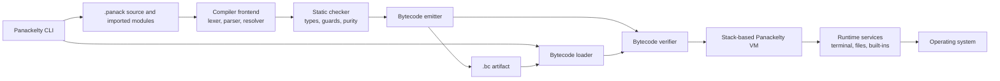
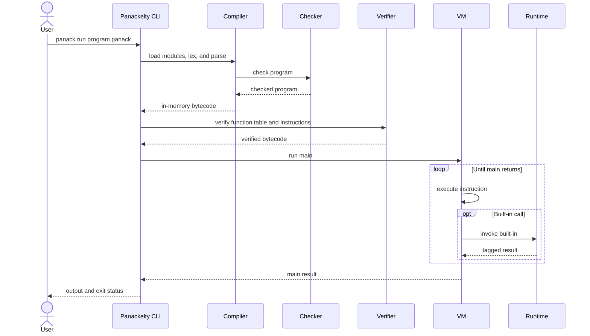
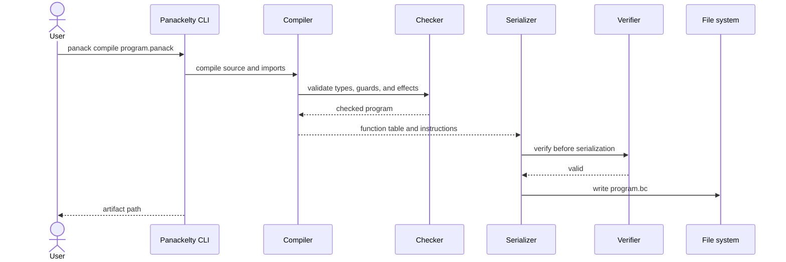
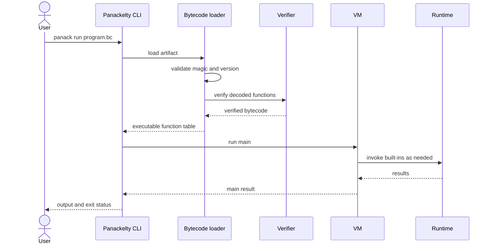
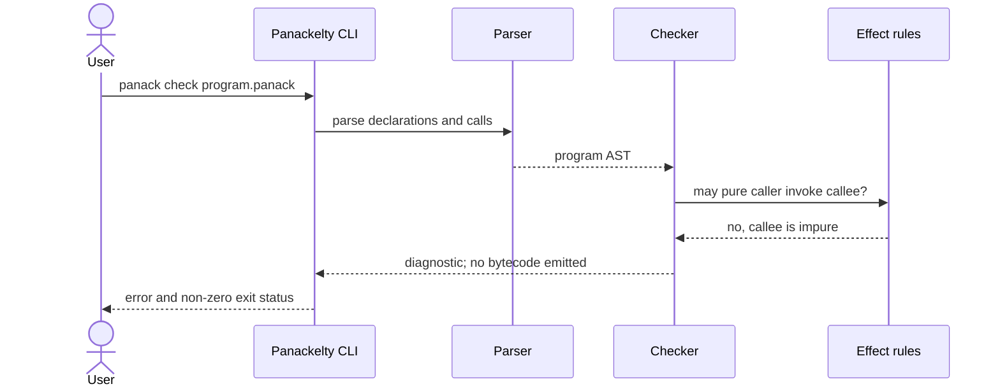
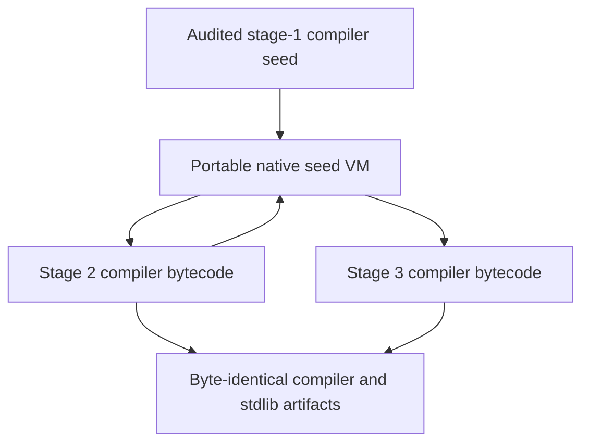

# Panackelty architecture

Website review builds and production share `scripts/assemble_site.sh` for
static site/playground assembly. The Node-only `scripts/preview.cjs` website
tool adds source identity and loopback serving; it is outside the native
toolchain dependency boundary. [PR previews](docs/PR_PREVIEWS.md) documents the
artifact and local author workflow. Running the tool without arguments builds
into a fresh OS temporary directory, serves on loopback and removes its own
files on stop or startup failure. Explicit build/serve commands preserve saved
artifacts. No hosted preview publisher is part of this design.

## Overview

Panackelty is a compiled language whose execution contract is its bytecode virtual
machine. Source execution is convenient shorthand for compiling to bytecode in
memory and passing that bytecode through the same VM used for saved `.bc`
files. There is no separate AST interpreter.

The public implementation is self-hosted. The `panack` launcher runs the
audited compiler seed on the portable C11 VM; that compiler is implemented by
the `.panack` sources under `src/compiler`. Version-8 artifacts execute on the
same VM. Stable component boundaries live under `src/compiler`,
`src/bytecode`, `src/vm`, and `src/runtime`.

`bootstrap/regenerate-seed.sh` refreshes the seed using only the native VM,
self-hosted compiler and shell utilities. It checks the recorded input SHA-256,
verifies fresh compiler stages 2–4 and their byte identity, then checks identical
standard-library artifacts and their expected runtime output before publication.
It uses a per-seed lock and rejects changed inputs. The seed and digest are
renamed separately; interruption between them is detected as a digest mismatch
on the next refresh. See `bootstrap/README.md` for review and recovery.

Development and release workflows use the self-hosted toolchain, C11 compiler
and shell utilities. Both platform package jobs validate with an allowlisted
command environment; a repository policy check enforces the dependency boundary.
The release smoke gate extracts and relocates the final archive, enters a fresh
working directory, restricts `PATH` to runtime tools,
then checks the public CLI, source compilation and execution, bundled standard
library discovery, argument forwarding, saved bytecode, and malformed-bytecode
rejection through the extracted `panack` command alone.

## Logical view


```mermaid
flowchart LR
    CLI["Panackelty CLI"]
    Source[".panack source and imported modules"]
    Frontend["Compiler frontend<br/>lexer, parser, resolver"]
    Checker["Static checker<br/>types, guards, purity"]
    Emitter["Bytecode emitter"]
    Artifact[".bc artifact"]
    Loader["Bytecode loader"]
    Verifier["Bytecode verifier"]
    VM["Stack-based Panackelty VM"]
    Runtime["Runtime services<br/>terminal, files, built-ins"]
    OS["Operating system"]

    CLI --> Source
    Source --> Frontend
    Frontend --> Checker
    Checker --> Emitter
    Emitter --> Artifact
    Emitter --> Verifier
    CLI --> Loader
    Artifact --> Loader
    Loader --> Verifier
    Verifier --> VM
    VM --> Runtime
    Runtime --> OS
```

The major components are:

| Component | Responsibility | Current location |
| --- | --- | --- |
| CLI | Dispatches `check`, `compile`, `run`, and `disasm` | Native launcher `panack`; Panackelty driver in `src/compiler/driver.panack` |
| Compiler | Loads modules and performs lexing, parsing, checking, and emission | Public implementation in `src/compiler` |
| Bytecode | Defines serialization, loading, verification, and disassembly | Contract in `src/bytecode`; independent native loader/verifier in `src/vm` |
| VM | Executes verified instructions using isolated stack frames | Portable C11 seed in `src/vm` |
| Runtime | Implements built-ins and the effectful host boundary | ABI contract in `src/runtime`; native implementation in `src/vm` |
| Standard library | Defines portable core types and APIs over deterministic primitives and the host ABI | Panackelty sources in `src/stdlib` |
| Project website | Presents the public language overview and routes readers to source documentation and releases | Dependency-free static files in `site`; deployed from protected `main` by `.github/workflows/pages.yml` |

## Repository layout

```text
panackelty/
├── AGENTS.md                development definition of done
├── Makefile                 canonical validation command
├── panack                    stable command-line entry point
├── bootstrap/               audited stage-1 compiler seed
├── src/
│   ├── compiler/            self-hosted Panackelty compiler
│   ├── bytecode/            bytecode format and verifier boundary
│   ├── vm/                  portable C11 seed VM and value model
│   ├── runtime/             built-ins and operating-system boundary
│   └── stdlib/              portable modules and public core APIs
├── examples/                user-facing Panackelty example programs
├── site/                    static GitHub Pages project website
├── tests/
│   ├── COVERAGE.md         specification-to-test coverage matrix
│   ├── quick_start.sh      packaged README workflow gate
│   ├── release_archive_smoke.sh  exact downloaded-artifact release gate
│   ├── unit/
│   │   ├── harness/        shell development contracts
│   │   └── vm/             native C module and fault tests
│   ├── runner/             Panackelty component and functional probes
│   └── functional/         complete Panackelty program and CLI tests
├── .github/workflows/       continuous validation, releases, and Pages deployment
├── ARCHITECTURE.md          this implementation description
├── ROADMAP.md               language and engineering initiatives
├── SPEC.md                  language semantics
└── SELF_HOSTING.md          bootstrap roadmap
```

The project website is a static artifact with an optional WebAssembly playground. Its homepage
navigation covers capabilities, executable examples, engineering evidence,
direction, vision and installation. Release and development-source capabilities
are labelled separately; `/playground/` runs the development compiler and VM
on-device using the maintained WASI profile described below. No compilation server
or persistent REPL is involved.
The canonical harness executes displayed examples through source and saved
bytecode using `tests/site_examples.sh`; Pages tests also check section and
accessible-label targets. The Pages workflow
tests assembly and source selection on relevant pull requests without deploying.
After successful push validation on `main`, the serialized website publisher
restores the exact-source browser-certified website and playground. Native-only
and documentation-only checks have no certificate and do not publish a website.
Coverage reports are published independently by
[`sproates/panackelty-coverage`](https://github.com/sproates/panackelty-coverage)
to [a separate Pages site](https://sproates.github.io/panackelty-coverage/).
When website bytes need rebuilding,
the publisher downloads the browser release pinned by `site/playground.json`,
verifies its SHA-256 and asset identity, and runs browser tests
against the complete assembled tree before uploading it. Missing assets or failed
browser tests stop publication. Post-deployment checks compare every playground
asset with that tree and verify the Wasm content type.
Browser releases are built and tested by `sproates/panackelty-browser`; website
updates deliberately pin a version and checksum rather than following its main.
The website owns publication and runs the integration suite from an exact
reviewed browser repository commit. Browser application sources and contracts
are maintained only in that downstream repository.
The website's `publication.json` identifies its source commit and successful
Check run. Coverage has its own source identity and deployment; missing reports
cannot block website publishing. The old `/coverage/` and `/coverage/html/`
entry points retain landing pages linking to the new host. Deep LLVM source URLs
are available on that host, not mirrored under the website. Only the website
deploy job receives `pages: write` and `id-token: write` in core.
Node is used for Pages/browser automation and its regression tests; the
native development, packaging and canonical validation toolchain is unchanged.

## Compiler pipeline

The effectful loader obtains source modules and assigns their canonical module
identifiers. Quoted file imports are rooted at their importer, `project/`
imports at the entry directory, and `stdlib/` imports at the active toolchain's
bundled library. The explicit namespaces avoid search-order ambiguity and make
resolution independent of the process working directory after the entry path
is resolved. The pure frontend accepts those already-loaded units, parses them,
walks the graph reachable from the entry module in dependency-first order, and
combines the reachable declarations into one namespace. Graph resolution
rejects missing units, duplicate identifiers, cycles, and declarations that
collide across modules. The name resolver then checks top-level and lexical
references. Before parsing, each lexer normalizes only terminating physical line
breaks into statement separators; breaks inside continued expressions remain
soft, so the AST and bytecode do not depend on source layout. Both parsers lower
`receiver.name(arguments)` to a receiver-first call AST. Ordinary method
spelling reuses global name
resolution, argument and generic checking, purity analysis, and bytecode
emission; dot access without parentheses remains a record-field AST node.
Method-only collection names lower to internal, unspellable built-in targets so
they cannot collide with global source functions. The checker resolves
`put/get/add` to their single collection family and accepts `has` only for Map
or Set receivers. Because the emitter deliberately consumes the existing
untyped AST, the VM safely dispatch the erased internal `has` call from the
runtime value tag after the static check. Explicit `@name` expressions create
non-capturing callable values whose `PureFn[...]` or `Fn[...]` type retains the
declared effect. `.call(...)` emits `CALL_VALUE`; array `map` and `reduce` lower
to ordinary iterator, persistent-array, and indirect-call instructions. The VM
rechecks dynamic target existence, arity, and purity for untrusted artifacts.
The
Panackelty-hosted checker validates types across the combined
module graph, infers local bindings and generic constructor results, checks control-flow result
joins and exhaustive matches, and proves the supported guard predicates and
safe natural subtraction facts. Both frontends reject calls from pure functions
to impure functions; the Panackelty-hosted purity pass enforces that boundary
across guarded-type predicates and all nested expression and statement
positions. Only a resolved, type-checked, and purity-checked program reaches the
emitter. The emitter produces a named function table containing stack
instructions and purity metadata.

`BindingStatement` carries an empty annotation string for `mut name = value`.
`AssignmentStatement` represents plain `name = value`; the resolver checks its
initializer before introducing a previously unseen name. The checker uses the
same lexical environment to distinguish inferred immutable declarations from
assignments. Inferred types must contain no unresolved constructor/collection
parameters at that declaration. Nested generic evidence is merged recursively.
The purity pass retains checked types for inferred locals, loop variables, and
pattern bindings so callable effects survive aliases and nested scopes.
The self-hosted frontend implements
these rules. The emitter still uses the existing `STORE` instruction for both
forms; the VM and bytecode format do not change. This is local inference, not a
solver that gathers constraints from later uses.

The Panackelty-hosted emitter in `src/compiler/emitter.panack` now lowers every
accepted AST form to the stable instruction contract. Its typed intermediate
representation keeps operand shapes explicit, and differential tests require
its instruction streams and absolute jump targets to match the bootstrap
emitter.

The Panackelty-hosted serializer in `src/bytecode/codec.panack` consumes that
typed IR and writes canonical version-9 artifacts using only portable byte
buffer operations. Complete artifacts are compared byte-for-byte with the
bootstrap serializer.

The matching loader in `src/bytecode/decoder.panack` bounds every read before
access, validates UTF-8 and canonical numeric forms without relying on host
exceptions, rejects trailing data, then verifies entry points, signatures,
control-flow targets, calls, arities, and purity edges. It also provides
disassembly and byte-identical load/reserialize operations.

`src/compiler/loader.panack` forms the effectful project boundary: it resolves
file-relative and logical imports, canonicalizes source paths, detects cycles
and missing files, and combines declarations in dependency order. The launcher
provides the source-checkout or installed standard-library root through the
compiler's environment snapshot; packaged layouts install the same source
modules beside the compiler artifact. It reads the release identifier from the
root `VERSION` file in a checkout or the installed copy and handles
`panack --version` without altering the reproducible compiler bytecode. The
checked program then crosses back into the pure emitter and serializer.

`src/compiler/driver.panack` implements all four public compiler operations.
Source `run` compiles to version-9 bytes and invokes the runtime's verified
nested-bytecode boundary; saved bytecode follows the same decoder and verifier.
The executable `src/compiler/main.panack` obtains program arguments and forwards
nonzero status through the runtime boundary.

Local mutation is not an effect in Panackelty. The checker permits `mut` bindings,
loops, and assignment inside pure functions because their state cannot escape
the call. Terminal input/output and file access are runtime effects and
therefore remain unavailable to pure functions.

The VM-to-host ABI is frozen in `src/runtime/ABI.md`. It is a named-call
interface for terminal, file, argument, environment, process, filesystem-query,
and nested-execution services. Arguments and environment are snapshotted when a
VM starts and inherited by nested execution. Deterministic collection, text,
byte, conversion, and lexical path operations remain VM primitives and require
no operating-system authority. File-I/O conformance covers UTF-8 text, arbitrary
bytes, missing and denied paths, missing parents, invalid text, and embedded-NUL
rejection before host APIs can silently truncate a path.

The standard library under `src/stdlib` has an implicit core and explicit
modules with a convenience `prelude.panack`. Canonical `Option` and `Result`
are portable enums loaded by every source compilation. Sorting and literal
suffix matching use private source-defined core functions selected by method
syntax; they add no VM primitives. Byte and checked-environment helpers remain
explicit Panackelty modules.
Generic source functions are checked with abstract type parameters. Calls infer
or explicitly supply a complete substitution, then validate their arguments and
result. Emission erases type arguments and retains one body per function, using
the existing tagged values and version-9 calls. Collection storage and lexical
path transforms remain deterministic VM primitives; array map/reduce retain
compiler lowering. Generic library helpers build on those operations. Stage tests
compile the complete prelude graph with both the bootstrap and self-hosted
compilers and require byte-identical artifacts.

## VM model

Each function call creates a frame containing:

- the function's instruction stream;
- a program counter;
- a map of local values;
- an operand stack.

Instructions push and consume tagged values. `CALL` invokes a statically named
target; `CALL_VALUE` resolves a checked callable value and revalidates its
target, arity, and purity before invocation. `RETURN` removes the current frame and pushes
its result onto the caller's operand stack. `Void` functions use an internal
sentinel so the VM keeps one uniform calling convention even though `Void` is
not a source value. Branch and iteration instructions change the current
frame's program counter.

The native dispatcher keeps Panackelty call frames in an explicitly owned heap
array. Direct and indirect calls push frames; returns transfer results and pop
frames without recursive C execution. An internal resumable handle can advance
by an instruction budget, preserve suspended state and release an unfinished
invocation. The synchronous CLI uses the same dispatcher to completion.
The experimental host-controlled profile intercepts process exit, rejects nested
bytecode and requires trusted immediate adapters for effectful services; the CLI
retains its existing host behavior. `tasks.c` adds an internal bounded task session
with parent/child joins, virtual deadlines and generation-qualified fake print
acknowledgements. This proves pending-operation lifetimes without OS I/O,
public spawning or resource scopes. Source async functions now reuse its typed
fake-read completion path. Task slots remain reserved until session destruction.
The independent `tcp.c` adapter adds a bounded source-level TCP exchange using
nonblocking POSIX sockets and owner-thread polling. Each execution owns at most
one connection, retained request and bounded response; completion reuses the
validated bytes/error schema. The native CLI drives polling while suspended;
embedded execution requires explicit opt-in and can use zero-wait polling.
Destruction closes the descriptor synchronously without callbacks or threads.
Fake task sessions retain their existing capability restriction. WASI returns
an explicit unavailable error. No new source resource ownership model is implied.
Ownership and status contracts are in the
[VM guide](src/vm/README.md#internal-resumable-execution).

The VM retains dynamic safety checks even when source checking should make a
failure impossible. These include collection bounds, `Nat` underflow, invalid
matches, and missing returns. This keeps execution safe when bytecode did not
originate from the current compiler.

Bytecode version 9 uses the compact typed binary payload introduced by version
5, retains version-6 method/string semantics and version-7 indirect calls, and
retains exact rational division, conversions, and first-class Unit values.
Version 9 adds an async function flag and direct/indirect await opcodes.
Functions are serialized
in ascending Unicode name order; opcodes, constant tags, count widths, and
operand layouts are fixed; strings are length-prefixed UTF-8; and numeric
representations are minimal and deterministic. Repeated compilation of
identical inputs and load/reserialize round trips must therefore be
byte-identical. Semantic or encoding changes still require a bytecode version
increment.

The complete value model, frame rules, instruction stack effects, version-9
binary layout, control flow, verification boundary, and trap conditions are frozen in
[`src/bytecode/FORMAT.md`](src/bytecode/FORMAT.md). Structurally valid but
dynamically invalid bytecode traps at the VM boundary instead of exposing a
host-language exception.

The [VM execution guide](docs/VM_GUIDE.md) complements that contract with actual
disassembly and recorded stack, local, and call-frame transitions for runnable
arithmetic, conditional-call, and loop examples.

Native strings record code-point count and an ASCII flag at construction.
Length reads that count; ASCII index, slice, and prefix offsets are direct,
while non-ASCII offsets traverse UTF-8. This removes repeated scanning during
compiler lexing without changing bytecode or language semantics.

The portable C11 seed VM under `src/vm/` independently decodes, verifies,
and executes version-9 artifacts. Its reference-counted values and
arbitrary-precision numerics use no third-party libraries. Fixed-expectation
tests run the complete program corpus and execute the Panackelty-hosted compiler
on the native VM. An adversarial instruction corpus also requires the VM to trap
on forged indirect
calls, arithmetic, byte, UTF-8, map, and operand-stack failures.

The same contract caps artifact bytes, functions, parameters, instructions,
names, text constants, operand collections, and numeric representations. Size
is checked before decoding, and length and count fields are bounded before
allocation or iteration. All remaining limits are
enforced for both loaded artifacts and compiler-produced in-memory bytecode.

## Use case: run source code

`panack run program.panack`, or the shorthand `panack program.panack`, compiles in memory
and executes the resulting bytecode. It does not create a `.bc` file.


```mermaid
sequenceDiagram
    actor User
    participant CLI as Panackelty CLI
    participant Compiler
    participant Checker
    participant Verifier
    participant VM
    participant Runtime

    User->>CLI: panack run program.panack
    CLI->>Compiler: load modules, lex, and parse
    Compiler->>Checker: check program
    Checker-->>Compiler: checked program
    Compiler-->>CLI: in-memory bytecode
    CLI->>Verifier: verify function table and instructions
    Verifier-->>CLI: verified bytecode
    CLI->>VM: run main
    loop Until main returns
        VM->>VM: execute instruction
        opt Built-in call
            VM->>Runtime: invoke built-in
            Runtime-->>VM: tagged result
        end
    end
    VM-->>CLI: main result
    CLI-->>User: output and exit status
```

## Use case: compile a bytecode artifact


```mermaid
sequenceDiagram
    actor User
    participant CLI as Panackelty CLI
    participant Compiler
    participant Checker
    participant Serializer
    participant Verifier
    participant FS as File system

    User->>CLI: panack compile program.panack
    CLI->>Compiler: compile source and imports
    Compiler->>Checker: validate types, guards, and effects
    Checker-->>Compiler: checked program
    Compiler-->>Serializer: function table and instructions
    Serializer->>Verifier: verify before serialization
    Verifier-->>Serializer: valid
    Serializer->>FS: write program.bc
    CLI-->>User: artifact path
```

## Use case: run saved bytecode

Running `.bc` bypasses the source compiler, but never bypasses validation.


```mermaid
sequenceDiagram
    actor User
    participant CLI as Panackelty CLI
    participant Loader as Bytecode loader
    participant Verifier
    participant VM
    participant Runtime

    User->>CLI: panack run program.bc
    CLI->>Loader: load artifact
    Loader->>Loader: validate magic and version
    Loader->>Verifier: verify decoded functions
    Verifier-->>Loader: verified bytecode
    Loader-->>CLI: executable function table
    CLI->>VM: run main
    VM->>Runtime: invoke built-ins as needed
    Runtime-->>VM: results
    VM-->>CLI: main result
    CLI-->>User: output and exit status
```

## Use case: reject an effect violation


```mermaid
sequenceDiagram
    actor User
    participant CLI as Panackelty CLI
    participant Parser
    participant Checker
    participant Effects as Effect rules

    User->>CLI: panack check program.panack
    CLI->>Parser: parse declarations and calls
    Parser-->>Checker: program AST
    Checker->>Effects: may pure caller invoke callee?
    Effects-->>Checker: no, callee is impure
    Checker-->>CLI: diagnostic#59; no bytecode emitted
    CLI-->>User: error and non-zero exit status
```

Purity metadata is also present in bytecode and rechecked by the verifier. An
invalid artifact cannot evade the source checker by directly encoding a call
from a pure function to an impure built-in.

Source tokens carry half-open offsets and one-based line and column positions.
The parser retains complete half-open expression spans, and the project loader supplies
the canonical owning-module path before parsing. Lexer and parser diagnostics
therefore use token positions directly; the resolver, type checker, and purity
checker preserve the nearest positioned expression as diagnostics flow back to
the driver. The public driver renders primary failures as
`file:line:column: message`, including failures from imported modules. The loader
retains a canonical-path-to-source map in `ProjectLoadState` and `LoadedProject`,
including sources that fail lexing or parsing. The pure `diagnostics.panack`
renderer uses these snapshots to append numbered lines and carets; it performs
no file I/O. Missing sources and invalid positions keep the original header.
The display escaping and tab contract is specified in `SPEC.md`.

## Bootstrap direction


```mermaid
flowchart TD
    Seed["Audited stage-1 compiler seed"]
    NativeVM["Portable native seed VM"]
    Stage2["Stage 2 compiler bytecode"]
    Stage3["Stage 3 compiler bytecode"]
    Fixed["Byte-identical compiler and stdlib artifacts"]

    Seed --> NativeVM
    NativeVM --> Stage2
    Stage2 --> NativeVM
    NativeVM --> Stage3
    Stage2 --> Fixed
    Stage3 --> Fixed
```

The bootstrap is complete: `make bootstrap-check` proves the fixed point, and
`make native-check` plus `make package` exercise the release path.
`make package` stages the conventional installed layout beneath a
single relocatable `panackelty/` archive root and adds the top-level README and
license plus the tested user-facing examples linked by the language tour. A
portable checksum target uses the host's `sha256sum` or `shasum`
implementation and records the archive's filename beside its digest. The
launcher derives its prefix from its own resolved path, so moving
the extracted directory preserves VM, compiler, version, and standard-library
discovery. Archive creation suppresses platform metadata sidecars and normalizes
stored ownership so release artifacts do not expose the build account. A
distribution test builds that archive, rejects unexpected paths,
files, and ownership, moves the extracted directory, and runs a standard-library
program through its public command.

The Check workflow runs on pull requests and pushes to `main`, avoiding a
second run on each feature-branch push. Concurrency groups cancel superseded
runs for the same pull request while preserving runs on `main`. Its validation
matrix partitions the canonical check into shared suites; focused developer
targets are not run again before them.

The CI packaging job is an explicit Ubuntu 22.04 x86-64 and macOS 14 arm64
matrix. Five clean suites per platform cover the complete check and package
proofs with only allowlisted commands visible, including bootstrap, native
conformance, exact-archive smoke testing, checksum generation and the packaged
quick start. The bytecode conformance suite retains the archive, checksum, source commit
and runner-image provenance as one workflow artifact; the stable package gates
require every suite to pass. The workflow has no tag or
release trigger, so producing validated CI artifacts cannot publish a release.

The separate tag workflow accepts only a tag equal to `v` plus the canonical
`VERSION`. Its read-only validation job runs `make check`; after that succeeds,
read-only matrix jobs rebuild the two native archives through `make package`,
which includes the fixed-point proof, native conformance, archive smoke gate,
and checksum generation. The final job depends on all three jobs, downloads
only their retained package artifacts, requires the exact six-file archive,
checksum, and provenance set, rechecks each digest and source commit, and then
uses its job-local write permission to publish the existing tag as a prerelease.

The final local package gate is the published quick start itself. It verifies
the adjacent checksum, extracts the README's marked program and expected output
from the archive rather than the checkout, installs the toolchain beneath an
isolated home, and runs the documented version, check, source-run, compile, and
bytecode-run commands with development tools absent from `PATH`. It also tests
the documented directory-swap upgrade and removal procedures. Both `make check`
and `make package` require this gate.

During `make check`, the functional compiler-driver checks reuse the
verified stage-2 compiler before the bootstrap phase produces stage 3 and proves
the fixed point. This keeps the proof singular without reducing its compiler or
standard-library comparisons. Focused compiler, bytecode, and VM targets combine
their internal suites with representative public-CLI checks. The complete validation phase timings are published in CI summaries and
retained as run artifacts; focused targets report timings when run locally.
`tests/profile_command.sh` adds opt-in inclusive wall-clock observations without
changing the validation graph or budget records. Native build commands, harness
groups, source probes and bootstrap stages carry parent labels; nested rows
overlap. Packaging CI retains clean suite profiles on both platforms, and the
separate profiling workflow collects focused native-warm measurements. `SELF_HOSTING.md` records the completed stages.

Self-hosted component unit probes execute on the native VM. Development harness
contracts use POSIX shell for fixtures and Make/archive/CI assertions, with a
Panackelty supervisor enforcing subprocess timeouts, signals and exact captured
bytes. Each invocation compiles that supervisor once into a temporary directory;
each shell group owns its isolated workspace and cleanup. `make unit` includes
the full harness; focused compiler checks include runner and corrupt-seed gates.
Sanitizer validation uses three independent jobs for VM contracts, oracle
programs, and the nested functional runner. Standalone sanitizer and coverage
commands execute the same complete sequence. Compiler probe scheduling puts
the longest independent checks first in the bounded worker pool. Harness and compiler checks
run concurrently in canonical unit validation and inside one CI job, keeping the
macOS matrix at five jobs. The local default assigns one worker to each suite;
runtime checks follow only after both succeed. One worker preserves serial execution.
Distribution checks build and install inside their temporary checkout with a
copied VM, retaining the shared executable unchanged for compiler commands.
CI assigns one worker to the harness and two to compiler probes. Runtime validation overlaps native corpus execution
with independent host/bytecode probes, retaining a two-worker bound. Native
conformance runs independent programs through two workers, each owning its
artifacts and captured streams; negative and archive gates remain sequential.
Bootstrap overlaps ordinary fixed-point verification with the independent
seed-refresh proof; their stages and publication checks remain isolated.

Both platforms partition `make check-no-interpreter` into five clean suites:
compiler/harness, runtime/functional, bootstrap, source conformance and bytecode conformance/packaging.
Each suite has an allowlisted tool environment. Together they retain the full
validation graph without repeating bootstrap after the complete check.

Compiled internal probes use a content-addressed cache under the build tree.
The key includes source names and bytes, the compiler seed, selected VM and
standard-library inputs. Cache entries contain verified bytecode and a digest;
publication follows a second input check. Every invocation still executes the
probe. Sanitizer and coverage executables have separate cache identities, and
public-CLI fixture compilation remains part of the behavioral tests. Independent
probes use a bounded worker pool with ordered output; setup and fixture mutation
remain serial.

## Rational and Unit values

The compiler recognizes `Rat` and `Unit` as first-class types. Integer division
emits the existing `BINARY /` instruction; the VM constructs a normalized exact
rational. Integer operands may participate in rational arithmetic. `()` lowers
to a pure `$unit` call and remains distinct from the internal Void sentinel.
Conversions and natural quotient division are pure runtime services. The native
VM owns arbitrary-precision numerator/denominator storage. Bytecode 8 rejects earlier artifacts because `/`
changed semantics. The compiler itself now uses explicit `quotient` calls.

## Opaque paths and time

The checker recognizes `Path`, `Duration`, and `Instant` as opaque types.
`src/stdlib/path.panack` owns path error declarations; `src/stdlib/time.panack`
owns clock/duration errors and portable duration arithmetic. The native VM
implements checked construction, lexical path operations, exact tick storage,
and clock reads in `src/vm/host_types.c`, declared by `host_types.h`.
Only `instant_now` crosses the host boundary. Both verifiers enforce its effect
and builtin arity; runtime tags prevent forged records from acting as opaque
values. These opaque types retain their original call-based representation;
the separate async extension adds the version-9 await instructions.

## Typed host capabilities

`src/vm/host_capabilities.c` owns typed POSIX file operations, process orchestration,
checked UTF-8 decoding, and sleep. The compiler and verifier register their exact
arities and effects. Processes use fork/exec with a launch-error pipe, a dedicated
process group, nonblocking pipe polling, bounded buffers, and monotonic deadlines.
`stdlib/host`, `stdlib/filesystem`, and `stdlib/process` define structured results.
The existing string-based file ABI remains necessary for the compiler bootstrap.

`stdlib/testing` is an explicitly imported Panackelty source module. Pure
assertions construct structured outcomes; effectful reporting prints them in
caller order. It adds no VM primitive or bytecode format change. Process checks
use the existing host APIs without introducing a second execution engine.
`stdlib/testing_files` now uses the existing typed filesystem boundary for
sorted immediate directory discovery and atomic temporary workspace creation.
Callers explicitly remove workspace contents before releasing the empty
directory; no new VM primitive or recursive removal operation is introduced.
`stdlib/testing_commands` routes through the existing typed `process_run`
boundary. Pure result comparators preserve byte-exact output and the
completed-process/host-error distinction; effectful wrappers return ordinary
`TestResult` values for deterministic reporting. It adds no new host ABI.

The [test suites](tests/README.md) combine Panackelty-hosted behavioral tests,
direct native C tests, and portable golden fixtures. The fixed-point bootstrap
and exact-artifact release gates provide independent evidence.
The `tests/runner/main.panack` selects twenty-five discovered success fixtures,
twenty example programs, and forty-one expected failure fixtures. It checks
source, compilation, and bytecode for successes; the failures check `check`
and `compile` diagnostics and require no bytecode artifact. Six selected
failures also assert exact diagnostics for `run` and `disasm`. Diagnostics are
normalized to `<case>` for exact comparison across checkout locations. It
verifies that every example source has a corresponding expected output and vice
versa. During `make check`, the native oracle smoke program executes this
runner and captures its successful report in a fresh check-session directory.
The functional phase reuses that observation alongside its self-hosted compiler
driver check. `runner_smoke` compares the exact report from source and bytecode;
standalone functional and oracle targets each execute the full runner. The
session is removed after the check, including on failure. Each owns an isolated workspace and reports cleanup failure. Native
harness tests inject report/fixture errors and assert failure and cleanup.

Direct bytecode/verification coverage runs in
`tests/runner/bytecode_unit.panack`, `tests/runner/bytecode_native_unit.panack`
and the native C verifier contracts in `tests/unit/vm/native_modules.c`.
These share fixed version-9 and malformed artifact vectors and compare exact
canonical artifacts and disassemblies. Fixture provenance and wire-format
expectations are documented in
`tests/fixtures/bytecode/contract_cases/README.md`.

The direct lexer, parser, resolver, type-checker, and purity contracts run in
`runner/compiler_lexer_unit.panack`, `runner/compiler_parser_unit.panack`,
`runner/compiler_resolver_unit.panack`, `runner/compiler_checker_unit.panack`,
and `runner/compiler_purity_unit.panack`
under `make unit` and `make check-compiler`. The parser imports the real compiler
module and checks 192 fixed syntax/diagnostic expectations across four entry
points. The resolver checks 26 fixed expectations for lexical names and
already-loaded module graphs, including precise imported-module diagnostics.
The checker checks 31 fixed source expectations and three module graphs.
The purity probe checks ten fixed sources and one module graph. Success requires
`ok`; failures retain specific diagnostic expectations. Independent goldens
and native/bootstrap checks are mapped in `tests/ORACLE_REPLACEMENT.md`.
The `cli_check_disasm` fixture checks source and bytecode validation, matching
disassembly, malformed bytecode rejection, and legacy source extension rejection.
The `cli_commands` fixture checks bare source/bytecode invocation, default
compile output, argument forwarding, process exit and stderr, help, and version.
The `cli_environment_files` fixture checks explicit environment overrides,
text and binary file round trips, missing paths, invalid UTF-8, and
permission denial on unprivileged POSIX hosts.
`cli_rational_failures` checks six source and bytecode runtime traps;
`cli_diagnostic_display` compares two exact diagnostic displays.
For `compiler_skeleton`, it resolves the `source.path` target physically within
the checkout and uses the verified stage-two compiler artifact for the bytecode
check when supplied by the bootstrap recipe.
For the `stdlib` case, a POSIX shell child unsets `PANACKELTY_STDLIB_VALUE`
before invoking the public CLI, preserving the functional suite's environment isolation without changing
the typed process API.

## Native VM module boundaries

The runner in `src/vm/main.c` delegates decoding to `decode.c`, semantic checking
to `verify.c`, and stack-machine execution to `execute.c`. `program.h` owns the
decoded representation and fixed opcode numbers. `value.h` owns runtime value
layout, while `vm.h` describes the invocation context. Reader and frame internals
stay private. Headers are self-contained declarations, not included implementations.

Value lifetime, exact arithmetic, rendering, UTF-8 traversal, and host services
are separate translation units. Builtins are grouped into text, collections,
numerics, nested execution, and host services. One registry supplies arity, purity,
and handler selection to verification and execution. Nested execution intentionally
calls back into the VM after decoding and verifying its child program.

Array append can share a backing store between a prefix and one extension,
with separate visible lengths. Branches, possible ownership cycles and large
object graphs copy;
dropping an extension releases its extra child immediately. This preserves
persistent semantics while amortizing eligible growth. The value model records
the bounded sharing and failure-cleanup invariants.

The Makefile compiles each component once, tracks generated header dependencies,
and reuses those objects for direct C contract tests. Native process tests reuse
the production runner. Sanitizer and LLVM branch-coverage targets use separate
build trees and also run in CI. A separately compiled fault-injection harness
redirects VM allocations and selected host syscalls, sweeps each allocation
failure position, and asserts memory, descriptor and child-process cleanup.
Production builds contain no fault controls.
See `src/vm/README.md` for the complete file map and ownership conventions.

The remaining direct compiler contracts now run in
`tests/runner/compiler_contracts_unit.panack` (201 assertions) and
`tests/runner/compiler_integration_unit.panack` (51 assertions), under both
`make unit` and `make check-compiler`. They cover emitter instructions, diagnostic
rendering and source snapshots, loader/imports and driver commands, generics,
inference, types and host boundaries. The probes use fixed expectations;
their provenance is recorded in
`tests/ORACLE_REPLACEMENT.md`. Seed regeneration uses verified self-hosted stages.


Direct VM execution and loader contracts run in `tests/runner/vm_unit.panack`
against the portable corpus in `tests/fixtures/vm_contracts`. Its 177 assertions
include native module, bigint and allocation-failure wrappers; header isolation
runs in `tests/native_headers.sh`. `make native-vm-contracts` runs this group,
and `make unit`, `make check-vm`, sanitizer and coverage gates include it.
The VM corpus checks 61 fixed execution contracts, including 21
per-artifact C return-kind assertions. Fixed independent arithmetic expectations
and builtin signatures run in `make native-oracle-contracts`.

Direct host, runtime and standard-library assertions run in
`tests/runner/host_runtime_unit.panack` with reviewed source and malformed
bytecode fixtures in `tests/fixtures/host_runtime`. The probe asserts native
process, file, path, environment and timing contracts and exact testing-library
reports. Direct C host checks and forced failures run under instrumentation.
The [fixture guide](tests/fixtures/host_runtime/README.md) describes direct native
evidence, fixed oracle fixtures and bootstrap cross-checks. Functional source
and bytecode cases verify public behaviour on both supported platforms.

### Change-aware validation routing

The Check workflow always starts on PR updates and main pushes. Its `changes`
job tests the routing/checking scripts, compares the complete merge-base-to-head
diff, and selects `docs` only when every old/new path is an allowlisted regular,
non-executable informational or audited process file. The local
`scripts/validate_change.sh` entry point consumes the same selector with staged,
unstaged and untracked inputs; its plan reports owners from
`scripts/validation_components.sh`. The
[component dependency map](tests/README.md#component-dependencies-and-retained-coupling)
explains why every non-document owner still selects the full integration envelope.
Unknown paths/history, executable documents,
symlinks, specifications, packaged inputs and mixed changes select `full`.
Renames are expanded to deletion/addition so neither path is hidden.

On both routes it checks documentation and local links; the documentation route
requires no native build or sockets. It checks whitespace in the change, document
conflict markers/NUL bytes, local inline/image/reference link destinations and
incoming links to informational files. It performs no network link requests
and does not validate heading fragments or implement a full Markdown parser.
The `test` and two `Package (...)` checks are short, bounded result gates on
Ubuntu. They always verify classification and the applicable execution result;
failed/cancelled/missing classification or full work fails them. The package
gates require the complete platform matrix to pass. Documentation-only changes
require full work to be skipped and produce no archive build or upload.
Cancellable `test_run` and `package_build` matrices retain every original
test, sanitizer, coverage and supported-platform packaging proof on the full
route. Ordinary validation uses the same unit subtargets as `make check`;
runtime and functional checks share a fresh session-local runner report.
Playground and Pages PR validation use the same selector, so shared and unknown
inputs reach browser consumers while documentation-only PRs skip their builds.
Production Pages publication remains a separate validated-current-main workflow.
Sanitizers and coverage run independently with their own complete instrumented
corpus. Bootstrap retains independent seed-refresh staging. Each job builds
its own native prerequisites: cross-job transfers would introduce a dependency
before small builds. No persistent cache or previous test result is required.
Bytecode conformance uploads the exact tested archive; its presence alone does not
certify the other suites, so consumers must also require the stable package gates. Only the short result gates use `always()`, preventing superseded builds
from staying alive and blocking new PR updates. The `validation-...` concurrency
group isolates the rollout from earlier unconditional jobs. Releases remain fully
validated independently of this classifier.

## VM/compiler boundary audit — 2026-09-30

Work record: [modularity task #106](https://github.com/sproates/panackelty/issues/106).
Audited revision: `5b508e7704380c46ce233339d12bd4408333609b` (website PR #108).
This is an investigation, not a new execution ABI or an implementation change.

**Finding: the VM already builds and executes independently of the compiler.**
Self-hosting creates a compiler-to-VM runtime dependency, not a VM-to-compiler
implementation dependency. Separate source-module compilation is a different
problem and is not required to preserve this component boundary.

### Dependency and contract map

| Component or workflow | Actual dependency | Meaning |
| --- | --- | --- |
| `make native` | `src/vm/*.c`, their headers, C toolchain, Makefile, VERSION and profiling shell helper | No compiler source, seed or standard library is needed |
| `native-unit`, `native-fault`, native bigint and header checks | C VM objects and C test sources | A useful compiler-independent test layer already exists |
| `native-vm-contracts`, `check-vm` | Panackelty test runner compiled by `tests/run_probe.sh`; broader targets also use compiler oracles | Test orchestration introduces compiler dependencies; the fixed bytecode subjects do not require compilation |
| Compiler | Compiler bytecode executed by VM; source imports and standard library while compiling | Expected self-hosting dependency; compiled applications need only their required runtime services |
| `panack` launcher | Checks VM, compiler seed, stdlib directory and VERSION before dispatching even a `.bc` input | Runtime-only installation is rejected before its direct VM execution branch |
| `install`, `package-archive` | Full launcher, VM, compiler seed, stdlib and documentation bundle | No dedicated runtime-only package target currently exists |
| Browser target | VM core plus an appropriate host implementation | Compiler separation alone does not provide browser compatibility |

The versioned contract is [FORMAT.md](src/bytecode/FORMAT.md): byte encoding,
version rejection, opcode semantics, calling/effect rules, validation and runtime
traps. Observable builtin names, argument/result kinds, effects and host behaviour
also matter; consult [SPEC.md](SPEC.md), the VM builtin registry and the compiler's
corresponding declarations. Compatibility tests must compare both implementations
against independent expectations, rather than merely checking they agree.

Private C layouts and ownership mechanics in
[VALUE_MODEL.md](src/vm/VALUE_MODEL.md) are implementation contracts, not a reason
to freeze every internal representation in the bytecode ABI. The experimental
C resumable/task APIs are explicitly not a stable embedding ABI. Nested-bytecode
services in `builtins_vm.c` execute supplied bytecode; they do not load a compiler
implementation implicitly.

### Reproduced evidence

On Linux x86_64 with Ubuntu GCC 13.3.0, create an empty temporary directory and
copy only `Makefile`, `VERSION`, `src/vm/`, `tests/unit/vm/`,
`tests/profile_command.sh` and `tests/native_headers.sh`, preserving paths.
There must be no `bootstrap/`, `src/compiler/`, `src/stdlib/` or `panack` launcher.
From that isolated directory run:

```sh
make native native-unit native-fault build/vm/test_bigint
./build/vm/test_bigint
sh tests/native_headers.sh
```

All commands passed. Native module tests include resumable execution, task and
async contracts, decoder mutations, verification, values and ownership. The
fault suite reported **1,903 allocation failures checked**. The bigint probe
printed `8999999999999999999999999999991`,
`999999999999999999999999999999`, and `1`. The unstripped VM executable was
106,208 bytes on this host and linked libc; this is not a portable distribution
size estimate or a WebAssembly size prediction.

Next copy `tests/fixtures/vm_contracts/` into the isolated tree. A temporary Node
harness decoded each manifest entry's hexadecimal artifact, invoked
`./panack-vm <mode> <artifact>` with a 30-second timeout and 1 MiB output bound,
and compared exit status and raw stdout/stderr with the checked-in expectations.
**All 145 manifest cases passed**, including successful execution, runtime traps
and invalid artifacts. No Panackelty compiler was used to produce these inputs.
The temporary harness adds no project dependency and does not replace the
canonical Panackelty runner or its additional wrapper assertions.

For reproducibility, the harness algorithm is:

```js
const fs = require('node:fs'), cp = require('node:child_process');
const assert = require('node:assert');
const dir = 'tests/fixtures/vm_contracts/';
for (const c of JSON.parse(fs.readFileSync(dir + 'manifest.json'))) {
  const p = dir + c.name;
  const hex = fs.readFileSync(p + '.hex', 'utf8').replace(/\s/g, '');
  assert(/^(?:[0-9a-f]{2})*$/i.test(hex));
  fs.writeFileSync('case.bc', Buffer.from(hex, 'hex'));
  const r = cp.spawnSync('./panack-vm', [c.mode, 'case.bc'], {
    timeout: 30000, maxBuffer: 1048576
  });
  assert.ifError(r.error);
  assert.strictEqual(r.status, c.status, c.name);
  assert.deepStrictEqual(r.stdout, fs.readFileSync(p + '.stdout'), c.name);
  assert.deepStrictEqual(r.stderr, fs.readFileSync(p + '.stderr'), c.name);
}
fs.unlinkSync('case.bc');
```

Changing the version field of a successful fixture to v8 was rejected with
`unsupported bytecode version`. Copying the unchanged `panack` launcher into this
runtime-only tree and asking it to run a valid artifact returned status 127 and
`native toolchain not found`, confirming the launcher prerequisite above.
Some corpus descriptions and source comments still say v8, reflecting historical
origins; the decoder enforces v9. Future fixture work must distinguish historical
capture metadata from current bytes and expected semantics.

### Recommendation and bounded follow-ups

Keep the existing component architecture and repository. Do not introduce a
linker, separate repository, new bytecode version or stable C embedding ABI to
solve a separation that already exists.

A **small-to-medium implementation slice, estimated one PR**, could expose a
clearly named compiler-independent native test aggregate and a runtime-only
package. Choose explicitly between documenting `panack-vm` as the runtime command
and allowing bytecode-only `panack` dispatch without compiler files. Preserve the
full developer installation and public source commands. Include relocated archive
execution, missing compiler/stdlib, valid and incompatible bytecode, arguments,
exit/trap behaviour, checksum/provenance and supported Linux/macOS tests. Retain
all existing source/bytecode integration, bootstrap, sanitizer and coverage gates.
This slice is recommended for assessment, not yet authorised implementation.

For compiler-independent execution of the full fixed corpus, prefer a reviewed
precompiled Panackelty harness with version/digest and reproducible regeneration,
or a bounded native fixture driver. Evaluate stale-fixture and duplicated-runner
risk before selecting either. Maintain source/bytecode parity in integration CI;
independent VM tests must not silently replace compiler-to-runtime compatibility.

A browser experiment can proceed without waiting for that packaging slice.
The concrete portability concern is host integration: `host_capabilities.c`
uses POSIX processes, descriptors, `poll`, signals, `waitpid` and sleeping;
`host_types.c` uses monotonic clock access; `host.c` supplies synchronous file I/O.
The current wildcard VM build links these host implementations. A browser port
must select/adapt services and explicitly reject unavailable operations while
preserving bytecode verification and observable supported semantics. Resumable
instruction budgets do not bound expensive builtins, allocation or cleanup in
wall-clock time. No WebAssembly build, browser timing, iPhone test or resource
isolation claim was established by this audit.

Dependency-aware probe caching and separate compilation retain their original
scope in #106. This audit neither measures incremental-cache savings nor promises
a reduction in full validation time. The next choice should compare browser
feasibility, runtime packaging and cache evidence on their own user value.

## Browser ownership and website delivery

[Panackelty Browser](https://github.com/sproates/panackelty-browser) owns the
WASI build, browser host adapter, JavaScript runtime, worker/controller, UI,
examples, asset versioning and browser tests. Core supplies the explicit
`browser-runtime-bundle`; the browser repository pins its core revision.
Its native CLI/corpus comparisons also use test-only fixtures from that same
revision. Updating core does not silently update the browser product.

The browser's single Check workflow verifies deterministic builds, native/WASI
contracts and all browser scenarios before publishing a checksummed versioned
release. No browser implementation, npm lockfile, SDK installer or duplicate
browser build workflow remains in core. Native validation and bundle conformance
remain core responsibilities; a deliberate downstream dependency update runs
browser compatibility checks when core changes are adopted.

Core owns website publication and coverage generation; the independent coverage
repository owns report publication. `site/playground.json` selects
the browser archive by tag, digest and asset identity. Pages downloads and
verifies it, checks out the browser integration suite at an exact reviewed SHA,
and runs all 24 browser scenarios against the assembled website before deploying.
Both the artifact pin and suite revision require review when behavior changes.
No browser compilation or native oracle is needed in Pages. Published-byte,
Wasm MIME, navigation and website-provenance checks remain deployment gates.

PR selection uses the shared component map: website, package, shared and unknown
inputs retain Pages checks; isolated native components and examples do not
provision engines for a pinned external product. Production always requires a
successful browser gate or trusted, fingerprint-identical certified bytes.
Browser engines come from the digest-pinned prepared Playwright image; matching
package/image versions and the locked dependency install are required.
The browser repository documents runtime bounds,
unsupported hosts, content-addressed caching and physical-device limitations.

The original preparation and delivery shipped in PRs #113 and #115. The historical
experiment below retains its original measurements and caveats.

## Browser-playground feasibility — 2026-09-30

Work record: [issue #110](https://github.com/sproates/panackelty/issues/110).
This bounded experiment used native baseline `a35e4e11da9412a7ede03d0c12e826d9428cb2ff`.
The existing compiler seed runs on a WebAssembly build of the VM and compiles
editable complete programs. This establishes executable Wasm feasibility under
Node, not supported browser-platform delivery or a persistent REPL.

### Prototype boundary

A disposable worker loads the existing v9 compiler seed and standard-library
sources into Emscripten's in-memory filesystem. One VM instance compiles
`/main.panack` to `/main.bc`; another instance verifies and executes that
artifact. Source, diagnostics and output remain local to the worker/page; there
is no server-side compilation or user JavaScript evaluation. Each Run creates a
fresh worker. Compiler failure prevents execution. The UI inserts output as text.

The C sources, bytecode format and seed are unchanged. The research build replaces
only `host_capabilities.c` with this deliberately restrictive adapter:

```c
#include "host_capabilities.h"
#include "vm.h"

Value *host_capability_call(VM *vm, const char *name, Value **arguments)
{
    (void)name;
    (void)arguments;
    vm->error = "VM trap: host capability unavailable in browser experiment";
    return NULL;
}
```

It rejects the whole typed capability dispatcher, including processes, typed
filesystem operations, sleeping and host UTF-8 decoding; this is broader than a
finished browser adapter needs to reject. Legacy bootstrap file calls use MEMFS,
not the device filesystem. Standard input returns EOF. The compiler's stdlib
path must be set in `preRun`, before libc snapshots the environment. Emscripten's
[filesystem overview](https://emscripten.org/docs/porting/files/file_systems_overview.html)
and [module lifecycle](https://emscripten.org/docs/api_reference/module.html)
describe the underlying mechanisms; the experiment tests their use here.

The first strict build with all native sources failed at `HC_MAX_NS`: a 32-bit
`size_t` can never exceed the 64-bit duration bound. Removing the POSIX component
avoids that compile error and unsupported process services. This does not repair
or certify the other host operations for wasm32. General 32-bit host portability
requires a separate audit rather than suppressing compiler warnings.

### Limits and cancellation

The page terminates its worker on Stop, a terminal response or a 15-second timer.
Tests terminate a running infinite loop and successfully run a new request.
The source/output bounds are 32,768 JavaScript string code units (not bytes);
an overflow diagnostic is additional output. Output accumulates in the worker,
preventing a message per printed line. Overflow posts one terminal response;
the owning page must terminate the worker. Throwing from the output callback was
insufficient in the initial experiment: libc could convert it to a write error
while the program continued. Worker termination is the cancellation boundary.

Each instance has a 2 MiB C stack, growable linear memory capped at 256 MiB,
and untrusted-bytecode verification. Compiler and runtime instances can coexist
until garbage collection; JavaScript buffers and MEMFS use additional memory.
The cap therefore is **not** a total tab/worker memory limit. Background tabs can
delay timers. Input validation, Wasm isolation and these responsiveness controls
are not a security certification, a real-time guarantee or a finished embedding
API. The current CLI execution path is reused; budgeted cooperative execution is
not required for this disposable-worker experiment.

### Reproduction and review source

The private [review prototype](https://panackelty-browser-experiment.sproates846529.chatgpt.site)
contains an **Experiment source** download with the adapter, build recipe,
worker/UI sources, generated artifacts, tests, evidence and license notices.
The Site source snapshot is `ad906be11f5e2e3057fbaee64275cefa9db92423`.
The downloadable `experiment-source.tar.gz` SHA-256 is
`2c05eb2851863f126c99d41bae8d527a6d1fd22cee68bef8e4e9b0005d652785`.
This owner-private research artifact is separate from the public website and
native toolchain. The repository records essential evidence even if that preview
is unavailable; its source snapshot is not a supported package release.

In the extracted experiment directory, with the baseline checkout available:

```sh
sh build-experiment.sh /path/to/panackelty /path/to/emcc "$PWD/dist"
node prepare-assets.cjs /path/to/panackelty
node test-worker.cjs
node test-ui.cjs
make -C /path/to/panackelty native
node test-vm.cjs /path/to/panackelty
```

The measured toolchain is Emscripten 6.0.10, SDK release
`666337b525e673e769121856d175f6f52b8ead64`, with Node 24.19.0 on Linux x86_64.
Compile the VM C sources except `host_capabilities.c`, substitute the adapter,
and use `-O2 -std=c11 -Wall -Wextra -Werror -pedantic -Isrc/vm` plus:

```text
-sMODULARIZE -sEXPORT_NAME=PanackVM
-sEXPORTED_RUNTIME_METHODS=FS,callMain,ENV
-sALLOW_MEMORY_GROWTH -sMAXIMUM_MEMORY=268435456
-sSTACK_SIZE=2097152 -sEXIT_RUNTIME=1 -sENVIRONMENT=web,worker,node
```

The SDK was isolated outside this repository. Emscripten itself uses Python;
that is an unresolved **production-build constraint**, not a new prerequisite
for Panackelty. The repository's no-interpreter policy and native validation are
unchanged. A production proposal must select a compliant build route or seek an
explicit policy decision; shipping opaque generated binaries is not a substitute
for a reproducible, reviewed build pipeline.

### Result and next gate

The [measurement record](tests/VALIDATION_PROFILE.md#browser-playground-feasibility--2026-09-30)
records actual Wasm execution, corpus differences, sizes and sample latency.
The architecture is promising enough for a focused browser integration proposal:
there is no need to rewrite the compiler, split repositories or introduce a new
bytecode ABI. Before production delivery, resolve the build-policy constraint,
exercise real Safari/iPhone and desktop browsers (including private-host asset
loading), test memory pressure/cancellation and define the supported host surface.
Automated browser rendering was unavailable in this environment; Node worker and
DOM-stub tests do not replace those checks. Cold network/phone performance is
unmeasured. The hosted page is supplied for user review, not labelled certified
for iOS. Persistent definitions, redefinition and state recovery remain separate
REPL design work. Public-site integration is unscheduled; estimate one or two
implementation PRs only after the toolchain/browser gates are resolved.

<a id="bounded-tcp-server-contract--proposed-implementation"></a>

## Bounded TCP server

The [source contract](SPEC.md#native-tcp-server-development-toolchain) implements
one finite awaited owner with named async handlers. `stdlib/tcp` supplies an
ordinary limits record; the compiler lowers `tcp_serve` to reserved `$tcp_serve`.
Encoding stays v9. Both verifiers require an async call and arity four. Runtime
checks validate record fields, integer ranges, actual handler ownership/kind and
completion shapes, preserving old saved user functions with the public name.

`tcp_server.c` owns a nonblocking listener and at most 32 reusable connection
slots. It retains at most 256 outcomes in acceptance order. Each connection
moves through read, handler-start, handler-run, write and free states. Poll
snapshots include the unique admission index as well as the descriptor: an
expired slot and reused descriptor cannot receive stale readiness. There are
no externally queued server completions or native producer callbacks.

`tcp_server_poll` performs bounded socket work, never user bytecode.
`tcp_server_advance` dispatches at most the supplied instruction budget, one
instruction at a time in rotating handler order. Each handler owns a child VM
context over the parent's borrowed verified program and snapshots. Ordinary
async effect checks remain active. Handler outbound TCP uses the existing
execution-owned exchange; the server rechecks these waits at most 1 ms apart
rather than exposing child descriptors. Ready handlers force a zero-wait poll.
This bounded polling adapter is not a scalable general-purpose reactor.

Per-client deadlines are checked before polling, after readiness and around
handler steps, including nested outbound awaits. Stopping closes admission and
begins bounded drain; destruction synchronously tears down child executions and
sockets. Expected client errors are reports, while handler traps/allocation
failure fail the owner. Separate embedded listening opt-in prevents existing
outbound permission from authorizing a server; children do not receive listening
permission, so recursive server invocation traps. WASI returns unavailable.

The CLI drives the same resumable dispatcher and owner pump. This does not
extend the fake-host `VMTasks` experiment into a public source scheduler or add
resource handles, general spawning, threads, indefinite servers, HTTP or TLS.
The [roadmap](ROADMAP.md#bounded-async-tcp-server) owns delivery state and the
subsequent broader grooming decision. Tests cover native ownership, source and
saved-bytecode peers, allocation/descriptor faults, capabilities and browser
rejection; [coverage evidence](tests/COVERAGE.md#bounded-tcp-server) records limits.

## Implicit core and standard methods

The loader loads the toolchain-owned `src/stdlib/core.panack` before the entry module, using the same canonical visited set. It internalises only the core algorithm tokens (`$core_ends_with`, `$core_first`, `$core_sort_by`), retaining source positions. The parser selects these identities for standard dot calls; generic checking and purity use their ordinary source signatures. Core enums are shared with the compiler, replacing its duplicate Result definition. Reachable core algorithms are emitted through existing calls; unused core algorithms are omitted. No VM, opcode or bytecode-v9 contract changes are required. Other stdlib modules remain explicit. Native packages and browser assets must carry the matching core source and compiler seed.

## Compiler and runtime understanding: initial investigation, 2026-10-01

Programme [#180](https://github.com/sproates/panackelty/issues/180) is in progress.
This is an initial shared investigation at core revision
`2952dd27bd8f48eedb09f173a60eab9f023d6aa6`, not a delivered explanation feature or
completion of the programme's realistic-program acceptance gate. Reproduction
and observed results are in the
[probe report](tests/VALIDATION_PROFILE.md#compiler-understanding-probes-2026-10-01).

### Existing evidence and where it is lost

| Workstream | Existing implementation evidence | Missing foundation |
| --- | --- | --- |
| #134: checker explanations | `TypeInfo`, local environments, `condition_facts` and `Bounds` in [checker.panack](src/compiler/checker.panack); effect checks in [purity.panack](src/compiler/purity.panack) | `CheckedExpression` retains only type information and diagnostics. Successful obligations, rule identities, assumptions and fact origins are discarded. Bounds must first be sound under mutation. |
| #173: compilation provenance | Tokens carry start/end information; the AST can retain `LocatedExpr`; emission already knows function-local instruction offsets | Parser binary-expression constructors omit location wrappers. [emitter.panack](src/compiler/emitter.panack) strips `LocatedExpr`; `FunctionCode` and `EmittedCode` retain no instruction/source relation. Method lowering, generated temporaries and erased generics need explicit attribution. |
| #174: inferred requirements | Local comparison bounds, concrete literal information, nominal guarded types and call substitutions | There is no general inverse constraint analysis or minimal-requirements solver. Relational guards between two variable operands and conjunction-based flow facts are not supported by the current subtraction proof. Derived requirements must be distinguished from requirements the current checker can discharge. |
| #175: semantic consequences | Resolved declarations, call expressions, declared effects and independently checked function bodies | No retained graph of proof dependencies or exported function guarantees. A weakened callee guard produces a local error, not a transitive proof report. Recompilation diagnostics alone cannot establish an unaffected property. |
| #172: runtime value provenance | [execute.c](src/vm/execute.c) frames retain function/PC, operands and locals during execution | [value.h](src/vm/value.h) has value tags and reference counts but no derivation identity. Values can be shared and old locals released. Instruction tracing alone does not explain value origins or control dependencies. |

The [loader](src/compiler/loader.panack) retains source snapshots, but
`PreparedProject` in the [driver](src/compiler/driver.panack) reduces diagnostics
to a string and does not retain those snapshots for a later explanation query.
The type-checking pass runs before the purity pass; type failure prevents the
latter from running. A report must distinguish a failed obligation from a phase
that was never evaluated.

### Correctness prerequisite

[Defect #182](https://github.com/sproates/panackelty/issues/182) is reproduced:
inside `if balance >= 2`, assignment `balance = 0` does not invalidate the
incoming lower bound. The checker accepts `balance - 2`; the VM then traps.
A write in a nested `if` reproduces the same failure. This affects the bundled
seed and a freshly compiled, byte-identical current compiler. The VM's runtime
check remains effective; this is a static proof defect, not evidence of memory
corruption. Bare immutable maps of facts do not establish immutability of the
program values they describe.

Repair must cover assignment evaluation order, nested expression writes,
branch joins and loop-carried changes. Removing a fact only after a direct
assignment is insufficient. Guarded assignments consume the same bounds and need
regression coverage too. Sound guarded decrements and fresh guards after writes
must remain usable. This prerequisite belongs within #134, not a sixth programme
workstream. Do not present a successful proof as trustworthy before this repair.

### Proposed evidence boundary

Use shared source and declaration identities, but separate static evidence,
emission mapping and dynamic execution records. This is a design recommendation
to test, not an implemented schema or an agreed public protocol.

- A static evidence record should identify the obligation and checker rule,
  source reference, outcome (`established`, `not established`, `unsupported` or
  `not evaluated`), supporting fact IDs and assumptions. Distinguish a disproved
  requirement from an inability to prove it. Produce the decision and its evidence
  together in the checker; rendering must not reconstruct reasoning independently.
- Facts need binding identity and validity across writes/control flow, plus the
  source and branch that established them. For the first subtraction slice,
  retain literal or lower-bound evidence and the required constant bound. Do not
  claim a general `amount <= balance` solver exists. Record unsupported relational
  or compound cases honestly.
- Keep opt-in evidence collection separate from ordinary compilation overhead.
  Compare check results with collection enabled and disabled. Retained source
  snapshots and per-revision identities must detect stale evidence rather than
  attaching it to changed text. Public machine output should be versioned only
  after the first consumers and stability requirements are understood.
- For #173, associate emitted function/instruction ranges with source origins and
  lowering steps. Explicitly identify generated instructions and many-to-one
  mappings. Prototype a validated sidecar before deciding whether bytecode format
  changes are necessary; bind it to the exact artifact and source revision.
  Generic bodies are erased, so a single instruction is not evidence of one
  unique generic call-site instantiation.
- For #174, start with one sufficient local requirement and recheck the proposed
  condition using the same compiler. Report alternatives and unsupported cases;
  do not call it the weakest requirement without a defined proof. General generic
  capabilities/traits and user result contracts are absent from current language
  semantics and must not be invented to fit illustrative issue examples.
- For #175, prototype explicit dependency edges from obligations to assumptions,
  declarations and call effects. Compare predictions with independently applied
  changes. An unaffected result needs positive justification within a defined
  analysis boundary; unchanged bytecode or missing diagnostics alone is inadequate.
- For #172, prototype a bounded, opt-in per-execution event graph with occurrence
  IDs, operand-origin edges and relevant control/call context. A `Value *` address
  is not a stable event ID. Define truncation, retention and effectful input
  handling before recording data; do not replay external effects to explain them.
  Initially measure a pure computation, then investigate host/async boundaries.

### Delivery sequence and remaining investigations

1. Repair #182 with direct/nested/loop/guarded-assignment regressions and a verified
   compiler seed. Establish position retention for the chosen explanation query.
2. Deliver #134's literal/lower-bound subtraction explanation from actual checker
   evidence, including rejected and unsupported cases. Expand types/effects only
   against explicit evidence and acceptance. Estimate: M / 1–2 PRs after the
   correctness repair; source-span changes may need their own PR.
3. Prototype #173's source-to-instruction mapping alongside the evidence boundary.
   Estimate: M / 1 bounded prototype PR before committing to artifact format.
4. Use that foundation for #174 sufficient-requirement and #175 dependency/change
   experiments. Each is M / 1 investigation/prototype PR; production scope and
   performance remain unknown until validated, especially across calls/recursion.
5. Investigate #172's event identity, bounded storage and control dependencies in
   parallel in the design sequence, with implementation staged after source
   mapping. Estimate: M / 1 prototype PR; broader runtime integration is unknown.

The repair estimate is S–M / 1 PR, subject to nested-write and loop findings.
These are provisional slices, not a total programme estimate or a promise that
all acceptance fits in these PR counts. All five remain in scope. Shared
evidence is a hypothesis to test, not a reason to block every workstream on one
universal graph. Remaining shared investigation includes concrete experiments
for sidecar integrity, runtime event retention and positive non-impact evidence.

### Realistic-program evaluation proposal

Use three complementary workloads and agree the final cases before acceptance:
a multi-module application with guarded accounting and generic helpers; actual
compiler/parser maintenance using source positions, bounds and collection code;
and a deterministic data transformation with an unexpected aggregate result.
Use existing code where suitable and publish complete reproducible programs.
Small probes in this investigation expose assumptions; they do not satisfy that
evaluation. Represent supported effects and imported calls, and preserve cases
that the analysis cannot answer.

Proposed initial budgets for review: no more than 5% median ordinary-check
regression on the compiler-as-input benchmark with collection disabled; bounded
static queries within twice the matching check time, reporting absolute latency
as well; a configurable hard event/byte cap for runtime tracing with explicit
truncation. Dynamic overhead needs a prototype before a defensible threshold.
These budgets are not yet accepted or achieved and small-program process timings
are not a substitute for measurements of a real workload.

An independent reviewer must complete the defined debugging/change tasks from
the output, with answers checked against real compiler/execution evidence.
Keep false claims, unhelpful answers, missing attribution and performance failures
visible in the acceptance report. The website should demonstrate verified released
behaviour only; the existing programme follow-up remains open.

## Guard fact invalidation

The #182 repair makes `check_block` thread its current bound facts through
statements. `facts_after_expression`, `facts_after_statement` and
`facts_after_block` conservatively identify writes in the AST, including branch,
match, call-argument, array/index and loop subexpressions. Written names retain
an unknown `Bounds` entry with neither endpoint asserted; unrelated facts remain.
Resolver rules prohibit shadowing, and calls cannot assign caller locals through
captured mutable bindings, so lexical names suffice for this bounded repair.

Before checking a compound expression, the checker drops incoming bounds for
all names it may write. This deliberately avoids relying on an assumed child
order or path feasibility. Direct assignment checks its RHS before discarding
the target's old bound. Loops discard loop-written bounds before checking their
condition/body to account for later iterations; while conditions can establish
fresh per-iteration facts. Effects of nested writes also invalidate the enclosing
block's facts for subsequent statements and its tail value. Guarded assignments
and function arguments consume the same corrected map as Nat subtraction.

This repairs the prerequisite found by programme #180; it does not add a new
proof system, source explanation interface or general relational reasoning.
The VM underflow trap and bytecode format remain unchanged. The earlier
investigation and timings above describe the pre-repair revision.

## Website validation and coverage publication boundary

The website consumes an explicit downstream browser release, independent of
native compiler/VM changes. The four-file static-site allowlist selects the
website route: Check prepares the website, runs all 24 browser scenarios in the
digest-pinned environment, and certifies bytes only on success. Required named
gates depend on website success; native matrices are skipped on this route.
Shared/publisher/mixed changes retain full native checks and applicable website
validation in parallel. Native-only changes require native success and an explicit
website skip. Missing applicability fails closed.

Pages defers PR/push validation to Check. Automatic publication ignores obsolete
trigger SHAs, requires exact-current-main successful Check, and consumes only
that source's `checked-website` certificate. Absence of a certificate is a no-op
for core/docs-only checks, never permission to build a website. Fingerprint
mismatch, bundled report files and symlinks reject restoration. PR artifacts
cannot seed production. A main advance before packaging fails publication.

Manual main dispatch can reuse a matching artifact from trusted successful main
Pages history, or build and validate when no matching identity exists. Expired
artifacts and API failures fail closed; `rebuild_website=true` explicitly bypasses
reuse for maintenance/cold measurements. Serialized publication records website
SHA and Check run in `publication.json`. An automatic duplicate compares that
record; exact matches skip transfer and deployment. Missing live identity causes
publication; lookup errors remain errors. Live verification checks website entry
points, local navigation, every playground asset, Wasm MIME and website identity.

Core still generates and archives native coverage in Check. The independent
[`panackelty-coverage`](https://github.com/sproates/panackelty-coverage) repository
selects successful trusted main reports, publishes the report with its source
identity, and verifies every report file. Its scheduled/manual publisher uses
its built-in GitHub token for public artifact reads. There is no cross-repository
secret or report download in website publication. Coverage freshness does not
depend on a newer website passing validation. The website keeps two compatibility
landing pages, not a copy of the report. See
[publication and maintenance](tests/README.md#public-coverage-publication).


## U1 source-mapping feasibility decision, 2026-10-02

The [bounded experiment](tests/experiments/source_mapping/README.md) attributes
an actual bounds-index trap to exact local, imported and generic source ranges.
It uses the loaded AST, actual emitted instruction list and real VM dispatcher;
the original U1 delivery left production compiler/VM sources and v9 bytes
unchanged. Unsupported and
generated instructions remain unavailable. U1 originally re-parsed the located receiver to recover the range; the U2
frontend slice below replaces that workaround with retained expression spans.

The U1 decision was to use optional deterministic sidecars: they
preserve executable compatibility and allow safe omission. Appending the same
payload to v9 is rejected, as expected; an embedded alternative requires explicit
versioning and has no demonstrated benefit for this first consumer. The prototype
validates bytecode/source identities, instruction indices, ranges, paths and an
integrity checksum. A recomputed forged checksum still permits false attribution;
producer authenticity, exact dependency snapshots and concurrent-file handling
are addressed by the local-replay U2 contract below. Generic attribution identifies the erased body, not a
specialisation. U1 is feasibility evidence, not the programme's realistic-program
acceptance or a public diagnostic feature. See the experiment for counterexamples,
representation trade-offs and revised consumer estimates.


## U2 frontend source-span foundation, 2026-10-02

`SourceSpan` pairs original-file `SourcePos` endpoints. `LocatedExpr` now retains
that span for literals, references, calls, arrays, unary/binary expressions,
postfix chains, conditionals, matches and match-arm blocks. Offsets count Unicode
code points; line/column coordinates are one-based and the end is exclusive.
The last consumed token determines the end, excluding following whitespace,
comments and statement separators. Parentheses include their delimiters in the
outer span; method lowering retains the original written range and each argument's
own span. Synthetic expressions without origin remain explicitly unavailable.

The loader preserves the owning module path and snapshot. Resolver, checker and
purity diagnostics use the span's start while retaining a child's more specific
position. New compound wrappers give previously unpositioned errors a source
location, including imported generic bodies. Executable instructions and bytecode
v9 are unchanged. The first frontend slice did not deliver instruction mappings;
the following emission slice supplies the internal relation described below.
Serialization, authenticity and source-aware runtime diagnostics remain open.

The U1 experiment now reads retained spans instead of re-lexing/re-parsing source.
Its original compatibility and trust limitations still apply. Parser range tests,
public CLI rejection locations, existing semantic suites and fixed-point seed
refresh cover this transition. See the [validation record](tests/VALIDATION_PROFILE.md#u2-frontend-source-spans-2026-10-02).


## U2 instruction-source emission, 2026-10-02

`compile_program_with_sources` returns executable `BytecodeProgram` alongside
`FunctionSources`. Each sparse `InstructionSource` has an absolute instruction
index within its function, the retained original `SourceSpan`, and a `lowered`
flag. Entries are unique and ordered by instruction index; an absent entry means
unavailable. There is no attribution by nearest instruction, inferred tail shape,
or bytecode disassembly. The same emitter constructs instructions and their
entries, including both sides of branches and loop bodies. Jump-target patching
and await rewriting preserve instruction count and metadata alignment. Unused
core functions and their source tables are pruned together.

A direct arithmetic, call, index, field or construction operation uses its own
expression range; its operands retain their smaller ranges. Short-circuit,
conditional, match and collection map/reduce machinery uses the owning expression
range with `lowered = true`. Interpolation variable loads use the whole literal
range and are marked lowered; the interpolation operation uses the literal range.
Await replaces only the terminal call opcode and preserves that invocation's
range, excluding the `await` keyword. Argument calls keep their original opcode
and origin. Erased generic functions retain the definition's original module and
range, not an invented per-instantiation body.

Statement stores/pops, statement-loop machinery, implicit void values and final
returns have no retained statement/declaration range and remain unavailable.
Explicit `()` has its own expression range. An unlocated synthetic child cannot
inherit a parent's origin. Missing entries are intentional gaps, not permission
for a consumer to guess another location.

Ordinary `compile_program` disables source retention. `FunctionCode`, the
serializer, bytecode v9 and the VM are unchanged; the metadata is a separate
internal result, not a new serialized ABI. The optional path must emit identical
bytes. The native experiment exercises emitted `INDEX_GET` locations, including
nested and non-tail expressions and collection callbacks. Production snapshots,
local-replay trust, validation, compatibility and CLI fallback are delivered by
the sidecar layer below, which covers all retained instruction entries.

## U2 validated source-map sidecar and CLI, 2026-10-02

The loader records the ordered exact source closure, including implicit core,
and exposes bounded UTF-8 loading for mapping. `source_maps.panack` serialises
portable identifiers, captured source bytes, executable bytes and the optional
emitter entries; balanced chunk joining avoids repeated whole-map copying.
`driver.panack` opts into this path through `compile --source-map` and `locate`.
Normal compilation and the VM bytecode contract remain unchanged.

Lookup regenerates the canonical pair from explicitly supplied local sources.
It compares foreign bytes under locally computed read bounds without decoding
foreign metadata, then renders the fresh in-memory attribution. The local
compiler and source tree establish trust; a self-asserted producer digest does
not. No automatic VM trap integration or source-free verification is added.
The [complete contract](docs/SOURCE_MAPS.md) records source disclosure, size
limits, stable-tree assumptions, compatibility and partial output handling.
The old test-only JSON/checksum sidecar and compiler adapter are removed; the
native observer now exercises these public commands against actual VM PCs.
